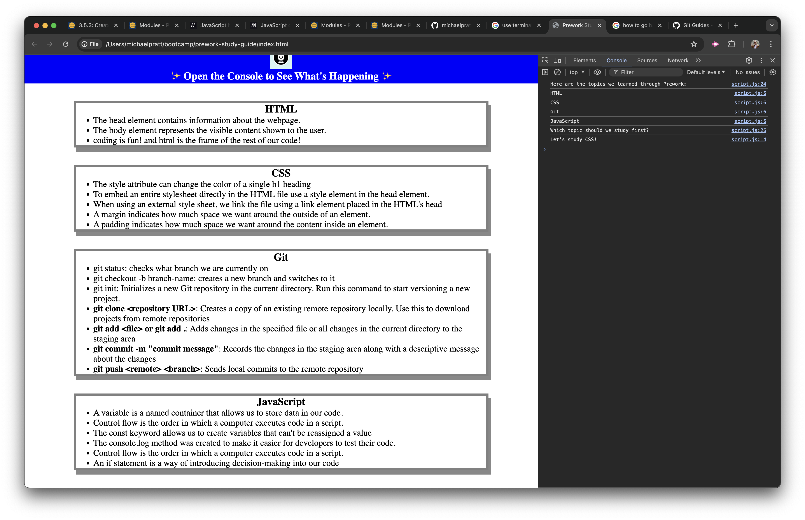

# Coding Bootcamp Prework Read Me

## Description

As a student enrolled in a coding bootcamp, I created this Prework Study Guide to better understand fundamental web development concepts before the classes start. This guide serves as a practical tool to get hands-on experience with HTML, CSS, Git, and JavaScript.

Motivation: My motivation was to gain a solid grasp of essential web development skills and feel prepared for the upcoming bootcamp.

Purpose: I built this project to bridge the gap between theoretical knowledge and practical application, ensuring I can confidently tackle more complex topics during the bootcamp.

Learning Outcomes: Throughout this project, I learned the basics of HTML structure, CSS styling, Git version control, and JavaScript programming, and how these technologies interact to create dynamic web pages.

## Table of Contents

- [Installation](#installation)
- [Usage](#usage)
- [Credits](#credits)
- [License](#license)

## Installation

To install and run this project locally, follow these steps:

1. Clone the repository
    git clone https://github.com/michaelpratt23/prework-study-guide.git

2. Navigate to the project directory:
    cd prework-study-guide

3. Open the index.html file in your web browser:
- use terminal and use the following command:
    open index.html

## Usage

Explore the different sections (HTML, CSS, Git, JavaScript) to see notes and key concepts. Open the browser console (usually by pressing F12 or right-clicking and selecting "Inspect" -> "Console") to see dynamic messages from the JavaScript code

Example:

## Credits

This project was created with the help of the following resources:

MDN Web Docs
W3Schools
GitHub Documentation

## License

This project is licensed under the MIT License. For more information, see the LICENSE file.